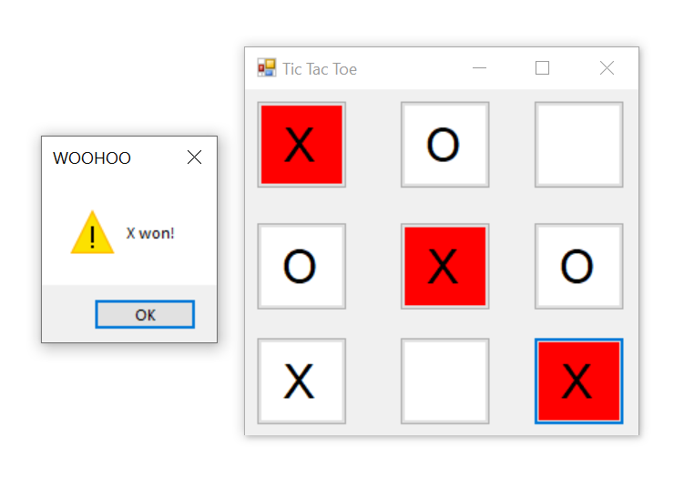

<h1 align = "center"> Tic Tac Toe - GUI </h1> 
<h2 align = "center"> AUTHOR: LE THIEN AN TRAN </h2> 
<h3> 1. About it </h3>

 
  

  

This is a tic tac toe game application - one of the childhood game I played when I was young. This is the first time I learned how to work with Graphical User Interface (GUI) during my second year at college. The purpose of this game application is for learning and extra practicing on C#. 

<h3> 2. How I Made It? </h3> 

Window Form App from Visual Studio allows me to create a .NET Window Forms. By this, I can easily create buttons box as grid cells and added into the game board (which is a string array).  
With help of Window Forms, it is much easier in creating functions and methods since the button itself already perform events. I just need to create: 
<ul>
  <li> playerSymbol() to draw the 2 player's after each turn </li>
  <li> CheckWinner(), CheckTie() using for loop to check a winner or a tie after each turn </li>
  <li> WinnerColor() for coloring the winner grid </li>
  <li> Restart() to restart the game </li>
 </ul>

<h3> 3. What I learned? </h3>

 <ol>
   <li> Basic concept of GUI </li>
   <li> Design user-interface and combine function from .NET Window Forms and my own method </li>
   <li> How to use Window Form App (or .NET Window Forms) for C#. </li>
 

    
